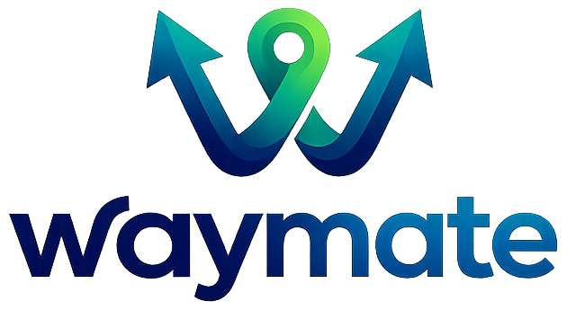

<div align="center">

# 🚗 waymate

### Smart MERN Stack Carpooling Platform

WayMate is a modern carpooling platform built using the MERN stack that helps users create, discover, and join rides easily.

Designed with a clean UI, secure authentication, and smooth ride management experience.

<br/>

### 🌐 Live Demo

👉 https://waymate-beta.vercel.app

<br/>

### 🔗 Repository

👉 https://github.com/aswinbkk/waymate

<br/>



</div>

---

# ✨ Features

## 👤 User Authentication

* Secure signup and login system
* JWT-based authentication
* Password encryption using bcrypt
* Protected routes and persistent sessions

---

## 🚘 Ride Management

* Create rides
* Update existing rides
* Delete rides with confirmation popup
* View ride details using modals
* Auto-filled ride update forms

---

## 🤝 Join & Leave Rides

* Join available rides
* Leave joined rides
* Track joined rides in **My Trips**
* Manage rides created by the user

---

## 🎨 Modern UI/UX

* Responsive design
* Styled-components based UI
* Smooth popup interactions
* Clean and modern interface
* Mobile-friendly experience

---

## 📂 Ride Categories

* Upcoming rides
* Joined rides
* Created rides
* Ride history management

---

# 🛠️ Tech Stack

## Frontend

* React.js
* Vite
* Styled Components
* React Router DOM
* Axios

---

## Backend

* Node.js
* Express.js
* MongoDB
* Mongoose
* JWT Authentication
* bcrypt

---

## Deployment

* Frontend → Vercel
* Backend → Render
* Database → MongoDB Atlas

---

# 📁 Project Structure

```bash
WayMate/
│
├── frontend/
│   ├── src/
│   │   ├── components/
│   │   ├── pages/
│   │   ├── hooks/
│   │   ├── context/
│   │   ├── layouts/
│   │   └── services/
│   └── public/
│
├── backend/
│   ├── controllers/
│   ├── models/
│   ├── routes/
│   ├── middleware/
│   ├── validators/
│   └── config/
│
└── README.md
```

---

# ⚙️ Installation & Setup

## 1️⃣ Clone Repository

```bash
git clone https://github.com/aswinbkk/waymate.git

cd waymate
```

---

## 2️⃣ Backend Setup

```bash
cd backend

npm install
```

### Create `.env` inside backend

```env
PORT=3000

MONGO_URI=your_mongodb_connection

JWT_SECRET=your_secret_key

CLIENT_URL=http://localhost:5173
```

### Run Backend

```bash
npm run dev
```

---

## 3️⃣ Frontend Setup

```bash
cd frontend

npm install
```

### Create `.env` inside frontend

```env
VITE_API_URL=http://localhost:5000/api
```

### Run Frontend

```bash
npm run dev
```

---

# 🚀 Deployment

## Frontend Deployment (Vercel)

| Setting          | Value         |
| ---------------- | ------------- |
| Framework Preset | Vite          |
| Root Directory   | frontend      |
| Build Command    | npm run build |
| Output Directory | dist          |

---

## Backend Deployment

You can deploy the backend using:

* Render
* Railway
* VPS
* EC2

### Important Production Setup

* Add environment variables
* Configure CORS properly
* Use MongoDB Atlas
* Enable secure JWT secret

---

# 🔐 Environment Variables

## Backend `.env`

```env
PORT=

MONGO_URI=

JWT_SECRET=

CLIENT_URL=
```

---

## Frontend `.env`

```env
VITE_API_URL=
```

---

# 📸 Screenshots

Add screenshots for:

* Home Page
* Ride Details Popup
* Create Ride Form
* My Trips Page
* Authentication Pages

---

# 📌 Future Improvements

* Real-time rider chat
* Google Maps integration
* Ride rating system
* Email notifications
* Payment integration
* Ride filtering & search
* Admin dashboard

---

# 🤝 Contributing

Contributions are welcome.

### Steps

1. Fork the repository
2. Create your feature branch
3. Commit your changes
4. Push to your branch
5. Open a Pull Request

---

# 📄 License

This project is licensed under the **MIT License**.

---

# 👨‍💻 Author

### Aswin

🔗 GitHub: https://github.com/aswinbkk

---

# ⭐ Support

If you like this project:

* Give it a ⭐ on GitHub
* Share it with others
* Contribute to improve WayMate

---

<div align="center">

### 🚗 Made with ❤️ using MERN Stack

</div>
